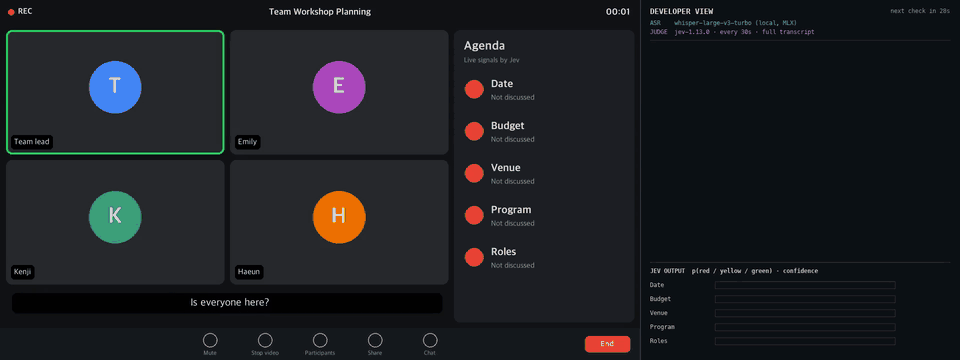

# Agenda Signal

**[Jev](https://docs.typesafe.ai/)로 회의 중 아젠다를 실시간으로 관리합니다.**

[English](README.md) · [日本語](README.ja.md)

회의가 진행되는 동안, 아젠다마다 신호등이 대화에 따라 바뀝니다.

| 신호 | 뜻 |
|---|---|
| 🔴 | 아직 이야기하지 않음 |
| 🟡 | 이야기는 했지만 아직 명확한 결론이 없음 (미룸, 결론 번복 포함) |
| 🟢 | 명확한 결론이 났고, 그 결론이 유효함 |

회의가 끝나기 전에 진행자가 어떤 아젠다를 아직 안 다뤘는지, 어떤 게 아직 열려 있는지 볼 수 있습니다.



*16배속. 왼쪽: 회의 화면과 Jev가 판정한 아젠다 신호. 오른쪽: 로컬 음성인식과 Jev 호출이
실제로 처리되는 과정. 느린 버전: [8배속 MP4](docs/demo.mp4).*

## 동작 방식

1분(또는 30초)마다 지금까지의 회의 텍스트를 Jev에 **한 번의 요청**으로 보냅니다.
아젠다마다 **Choice 질문 하나**를 붙이면 Jev가 모든 질문을 병렬로 판정해
신호와 확률을 돌려줍니다.

```python
Choice(
    instructions={
        "agenda": {"id": "A2", "title": "Budget", "description": "How much money can be spent on the workshop."},
        "question": "What is the status of `agenda` in `transcript`?",
    },
    criteria={
        "red": "Not talked about yet. The same words used about something else do not count.",
        "yellow": "Talked about, but there is no clear conclusion yet. This includes putting it off, "
                  "or taking back an earlier conclusion.",
        "green": "A clear conclusion was reached, and it still stands.",
    },
)
```

반복과 흐름은 코드가 맡고, Jev는 좁은 판단만 합니다. 코드는 `src/agenda_signal/judge.py`.

## 결과

20분짜리 가상 회의 5개를 한국어·영어·일본어로 준비하고, 신호가 바뀌는 시점을 사람이
라벨링했습니다. Jev(`jev-1.13.0`)로 1분마다 판정 → 대본 5개 × 20회 × 아젠다 5개 =
언어당 500판정.

| 지표 | 한국어 | 영어 | 일본어 |
|---|---|---|---|
| 매 판정 시점의 신호 정답 | 489 / 500 (97.8%) | 491 / 500 (98.2%) | 492 / 500 (98.4%) |
| 최종 신호 정답 | 23 / 25 | 25 / 25 | 25 / 25 |
| 함정 통과 | 13 / 14 | 14 / 14 | 14 / 14 |
| 신호 전환 감지 | 30 / 31 | 30 / 31 | 30 / 31 |
| 전환 후 반영까지 (중간값) | 36초 | 37초 | 36초 |

- 세 언어가 같은 신호를 낸 판정: 490 / 500.
- Jev 호출 1회 약 0.27초. 비용은 **20분 회의 1개당 약 $0.003**.
- 함정은 실제 회의에서 흔한 장면들입니다: 아젠다 키워드 없이 결론 내기, 같은 단어가 다른
  맥락에서 나오기, 이름만 나오고 미루기, 결론 번복, 한 문장에 두 결정, 막판 1분에 처음 나온 아젠다.
- 앞단에 로컬 ASR(Whisper large-v3 turbo)을 붙였을 때, 음성 30초 분량을 2초 안에
  처리했고(ASR + Jev) 판정 정답은 97 / 100(한국어), 112 / 115(영어)였습니다.

## 빠른 시작: 샘플 회의 재생

여기서는 음성도 음성인식도 쓰지 않습니다. 샘플 회의는 텍스트 대본이고, `run`이 대본을
1분씩 실시간 회의처럼 Jev에 넣은 뒤 정답과 비교합니다.

Python 3.11 이상과 [uv](https://docs.astral.sh/uv/)가 필요합니다.

```bash
uv sync
uv run pytest                                        # 오프라인 테스트
uv run agenda-signal validate                        # 데이터셋 검사

# API 키 없이 전체 흐름 확인 (가짜 판정기는 항상 🔴라고 답합니다)
uv run agenda-signal run --lang en --version good --judge fake

# Jev로 실행
cp .env.example .env                                 # TYPESAFE_API_KEY 입력
uv run agenda-signal run --lang en --version good    # 20회 호출, 약 $0.003
uv run agenda-signal eval runs/<run_id>              # 지표 + 분 단위 타임라인
```

`run`은 대본을 1분씩 재생하며 판정해 `runs/<run_id>/ticks.jsonl`에 기록합니다.
`--version`을 빼면 대본 5개를 모두 돌리고, `--lang`은 `ko`, `en`, `ja` 중 하나입니다.
중간에 끊기면 `run --resume runs/<run_id>`로 이어서 돌릴 수 있습니다.

## 내 ASR과 연결하기

음성인식은 포함돼 있지 않으니 원하는 것을 직접 연결하세요. 아래 `my_asr()` 자리에 넣으면
됩니다. 문장이 확정될 때마다 `(회의 시작부터 지난 초, 텍스트)`를 내보내면 되고, 나머지는 그대로 둡니다.

```python
from agenda_signal.judge import JevJudge, build_questions
from agenda_signal.models import Agenda, Utterance
from agenda_signal.state import build_state

agendas = [
    Agenda("A1", "Date", "When the workshop will be held."),
    Agenda("A2", "Budget", "How much money can be spent on the workshop."),
    # ...
]
judge = JevJudge()                     # TYPESAFE_API_KEY를 읽습니다
questions = build_questions(agendas)
transcript: list[Utterance] = []


def my_asr():
    """여기에 내 음성인식이 들어갑니다.

    확정된 문장마다 (t_sec, text)를 yield 하세요. 예: Whisper, 클라우드 음성인식 API,
    회의 도구의 실시간 자막.
    """
    raise NotImplementedError("여기에 내 음성인식을 연결하세요")


last_check = 0.0
for t_sec, text in my_asr():                          # <- 내 ASR이 보내는 문장
    transcript.append(Utterance(t_sec, "unknown", text))
    if t_sec - last_check >= 30:                       # 30초마다 판정
        result = judge.evaluate(build_state(transcript, t_sec), questions)
        signals = {agenda_id: p.choice for agenda_id, p in result.predictions.items()}
        print(signals)                                 # 예: {'A1': 'green', 'A2': 'yellow'}
        last_check = t_sec
```

데모에서 얻은 팁:

- 음성을 조각 단위로 받아쓴다면, 조각의 마지막 문장은 확정하지 말고 다음 조각에서 다시
  받아쓰세요. 문장 중간에서 잘려 있는 경우가 많습니다.
- 화자 구분은 없어도 됩니다. 데모에서는 모든 문장을 `"unknown"`으로 보냈습니다.
- 아젠다 설명은 쉬운 한 문장으로 쓰세요. Jev는 지시문을 글자 그대로 읽습니다.

## 데모는 이렇게 만들었습니다 (로컬 Mac)

실시간 데모는 Jev API 호출을 빼고 모두 Mac 한 대에서 돌렸습니다. 데모용 도구는 이 저장소에
포함하지 않았고, 사용한 구성은 아래와 같습니다.

| 단계 | 사용한 것 | 내용 |
|---|---|---|
| 음성 인식 | [mlx-whisper](https://github.com/ml-explore/mlx-examples/tree/main/whisper) 0.4.3, 모델 `mlx-community/whisper-large-v3-turbo` | 30초마다 새로 들어온 음성을 받아쓰고, 마지막 문장은 다음 차례에 다시 받아씀 |
| 아젠다 신호 | Jev `jev-1.13.0` | 30초마다 지금까지의 회의 텍스트 전체로 판정 (이 저장소와 같은 방식) |
| 영상 | Pillow로 프레임을 그려 ffmpeg로 인코딩 | 화상회의 화면 + 아젠다 패널 + 개발자 화면(처리 로그, Jev 확률) |

30초 단위 처리 시간(실측): ASR 최대 1.1초, Jev 최대 0.7초.

## 데이터셋

| 대본 | 회의 | 최종 신호 (A1–A5) |
|---|---|---|
| `good` | 워크숍 준비, 잘 진행된 회의 | 🟢🟢🟢🟢🟡 |
| `normal` | 워크숍 준비, 시간이 모자란 회의 | 🟢🟡🟡🔴🔴 |
| `bad` | 워크숍 준비, 잡담과 결정 번복 | 🟡🔴🔴🟡🔴 |
| `office_move` | 사무실 이전 | 🟢🟢🟡🟢🟡 |
| `onboarding` | 신입사원 입사 준비 | 🟢🟢🟡🔴🔴 |

```
data/
├── scripts.json                     대본 → 주제 + 최종 정답 신호
├── agendas/<topic>.json             주제별 아젠다 5개
├── transcripts/{ko,en,ja}/<script>.jsonl
├── gt/<script>.json                 정답: 신호가 바뀌는 시점
└── outlines/<script>.md             사람이 읽는 요약, 함정, 예상 신호
```

대본 한 줄: `{"t_sec": 0, "speaker": "lead", "text": "..."}`.
정답 이벤트: `{"t_sec": 272, "agenda": "A1", "signal": "green"}`. 어떤 시점의 신호는
그 시점 이전의 마지막 이벤트입니다(없으면 🔴). 영어·일본어는 같은 발화 시각을 유지한 번역이라
정답을 공유합니다.

## 한계

- 20분 회의에서만 검증했습니다. 매번 대본 전체를 보내므로 회의가 길어질수록 입력이 커집니다
  (이번 대본 기준 1분에 약 235토큰). Jev 입력 한도(3.2만 토큰), 긴 입력에서의 정확도,
  호출당 비용 증가는 검증하지 않았습니다.
- 가상 회의이며 정답은 한 사람이 라벨링했습니다.
- 실행마다 결과가 조금씩 다릅니다 (500판정 중 ±1~2).

### 참고: 최근 구간만 보내는 방식

회의 텍스트 전체 대신 최근 3분 대화와 직전 신호만 보내는 방식도 시험했습니다. 한국어 대본
5개에서 정답과 일치한 판정은 410 / 500(82%)으로, 전체를 보낼 때(98%)보다 낮았습니다. 가장 많은
오답(90개 중 44개)은 결론이 3분 구간 밖으로 밀려나면, 직전 신호가 🟢였는데도 Jev가 🔴로 답한
경우입니다. Jev는 눈앞의 내용을 판정할 뿐이라, 이전 상태를 기억해서 이어 가게 하는 방식은
통하지 않았습니다.

그래도 회의 텍스트 전체를 보내는 게 부담이 되는 상황에서는 구간 방식이 더 나을 수 있습니다.

- 긴 회의(대략 1시간 이상): 전체 텍스트가 Jev 입력 한도(3.2만 토큰)에 가까워지거나, 관계없는
  내용이 길게 쌓여 정확도가 떨어질 때.
- 긴 회의에서 자주 판정할 때: 매번 전체를 보내면 비용과 지연이 판정 횟수만큼 불어나지만,
  구간 방식은 호출마다 입력 크기가 작고 일정합니다.

제대로 하려면 상태는 코드가 들고 있어야 합니다. Jev는 최근 구간에서 생긴 일(언급 없음 / 논의함 /
결론 남 / 결론 번복)만 판정하고, 코드가 신호를 갱신합니다. 언급이 없으면 신호를 그대로 둡니다.
이 방식은 구현하거나 검증하지 않았습니다.
